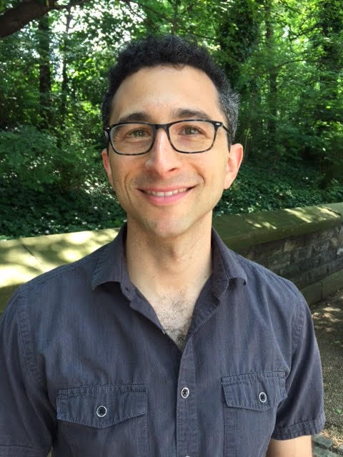

Brian Segal is a Quantitative Scientist at [Flatiron Health](http://www.flatiron.com).

[curriculum vitae ]({{ BASE_PATH }}/assets/bdsegal_cv.pdf) 
[orcid](http://orcid.org): [0000-0002-2568-2541](http://orcid.org/0000-0002-2568-2541) 

---

<h4>contact</h4>

    

        

            Brian D. Segal 
            <a href="http://www.flatiron.com"> Flatiron Health</a> 

            

            Email: <code>bseg</code><b>I</b><code>al</code><b>don't</b><code>@</code><b>want</b><code>bio</code><b>spam!
            </b><code>stat</code><b>So</b><code>.</code><b>please</b><code>flat</code><b>leave
            </b><code>iron</code><b>me</b><code>.</code><b>alone</b><code>c</code><b>!</b><code>om</code> 
            Phone: 202-870-4049
            

        

        

        
        

    

